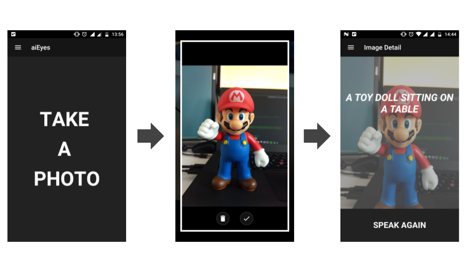

#  aiEyes

> Describes photos using audio for Blind and Visually-Impaired Users.

*aiEyes* is an open source app that helps the Blind and Visually-Impaired Users to **see** the world with the help of [artificial intelligence](https://en.wikipedia.org/wiki/Artificial_intelligence). Developed with [Ionic framework](https://ionicframework.com/), [Azure Computer Vision API](https://azure.microsoft.com/en-us/services/cognitive-services/computer-vision/) and [Google Translate API](https://github.com/matheuss/google-translate-api) it is able to describe pictures to the user.

Inspired by *@adrielcafe* [BeMyEyesXamarinApp](https://github.com/adrielcafe/BeMyEyesXamarinApp).



### Demo Video
[](https://youtu.be/k8kd785kfMY)

### :heart: Found this project useful?

If you found this project useful, then please consider giving it a :star: on Github and sharing it with your friends via social media.

## Getting Started

#### Get API Key

Create your Computer Vision API API Key here: https://azure.microsoft.com/en-us/try/cognitive-services/

Modify the file `src/utils/keys.ts` with the value of your API Key.

#### Installation

First of all, install the dependencies to run this app:

```
$ npm install -g cordova ionic
```

Install dependencies:

```
$ npm install
```

#### Run the app on your phone

```
$ ionic cordova platform add android
$ ionic cordova run android
```

or

```
$ ionic cordova platform add ios
$ ionic cordova run ios
```

## Contributing

If you want to help, please read the [Contributing](https://github.com/brenopolanski/aiEyes/blob/master/CONTRIBUTING.md) guide.

## History

For detailed changelog, see [Releases](https://github.com/brenopolanski/aiEyes/releases).

## Credits

## Donations

Donations would be more than welcome :)

[](https://www.paypal.com/cgi-bin/webscr?cmd=_s-xclick&hosted_button_id=WNXA4YYGQCJZG)

## License

[MIT License](http://brenopolanski.mit-license.org/) © Breno Polanski
